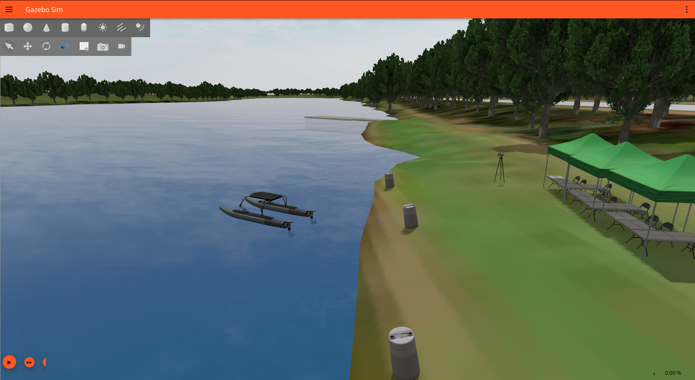

# Autonomous USV Control & Navigation (ROS 2 & Gazebo)

This repository contains the source code developed for my Engineering Thesis regarding the autonomous control of an Unmanned Surface Vehicle (USV). The project focuses on the implementation and comparative analysis of path-following and navigation algorithms in a simulated maritime environment.

 
*Fig 1. USV WAM-V model during autonomous navigation tests in Gazebo Sim.*

### 📄 Thesis Documents
The full text of the engineering thesis is available here:
* **[Polish Version (Original)](Thesis_PL.pdf)** - Official reviewed version.
* **[English Version (Translation)](Thesis_EN.pdf)** - Translated via Gemini Thinking (Dec 25, 2025) for international sharing.

### 🚀 Key Features
* **Simulation Environment:** Gazebo Sim (Maritime Gazebo).
* **Control Algorithms:** Implementation of **LOS (Line-of-Sight)**, **ILOS (Integral LOS)**, and **PID** controllers for trajectory tracking.
* **Navigation & Fusion:** Hybrid navigation system using **EKF (Extended Kalman Filter)** to fuse GPS, IMU, and Magnetometer data.
* **Framework:** Fully integrated with **ROS 2** (Humble/Jazzy).

### 🛠 Tech Stack
* **Language:** Python 3
* **Middleware:** ROS 2
* **Simulator:** Gazebo Sim
* **Libraries:** NumPy, Robot Localization
